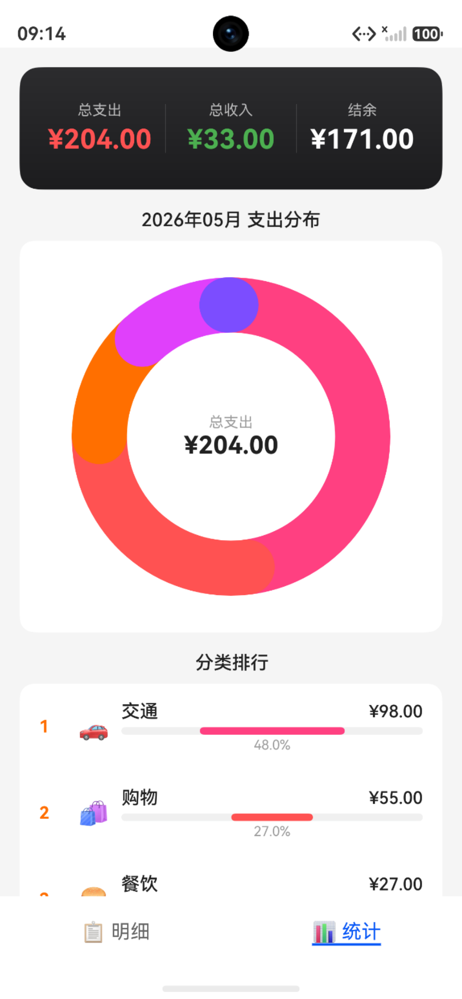
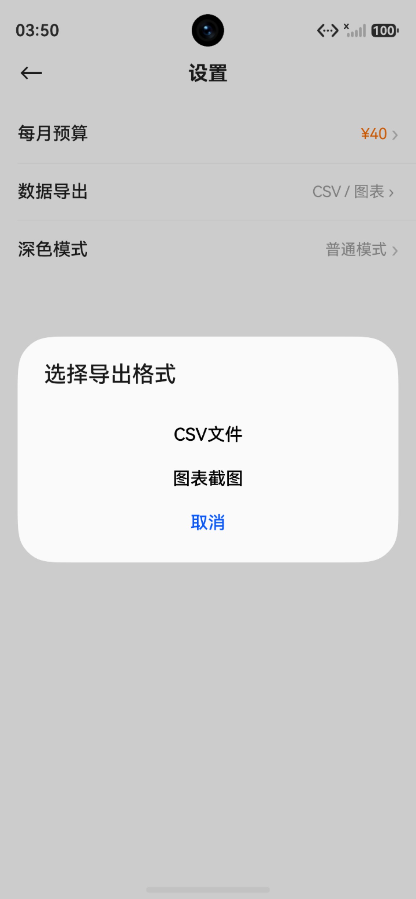

# 黑豆记账 (BlackBean Ledger)

一个简洁优雅的鸿蒙原生记账应用，使用 ArkTS + ArkUI 开发。

## 一、项目展示
|         首页         |        统计页面         |        添加明细         |
|:------------------:|:-------------------:|:-------------------:|
|  |  |  |

|         明细详情         |         编辑明细         |         删除         |
|:--------------------:|:--------------------:|:------------------:|
|  |  |  |

|         设置页面         |         预算设置         |        超支提醒        |
|:--------------------:|:--------------------:|:------------------:|
|  |  |  |

|         数据导出         |         图表导出         |         深色模式         |
|:--------------------:|:--------------------:|:--------------------:|
|  |  |  |
## 二、功能特性

- **收支记录** — 支持收入/支出双类型，涵盖餐饮、交通、购物、工资、理财等十余种分类
- **时间线明细** — 按日期分组展示账单明细，支持「今天 / 昨天 / N年N月N日」友好日期格式
- **月度统计** — Canvas 环形图可视化支出分布，分类排行榜带百分比进度条
- **编辑与删除** — 点击明细进入详情页，支持修改记录和确认后删除
- **自定义数字键盘** — 原生数字输入体验，屏蔽系统键盘，支持加减运算
- **本地存储** — 基于 HarmonyOS relationalStore 的 SQLite 数据库，数据安全可靠

## 三、页面结构

| 页面 | 路径 | 说明 |
|------|------|------|
| 主页（Tab） | `pages/Index` | 明细列表 + 嵌入统计视图，右上角 `+` 按钮记账 |
| 记账页 | `pages/AddRecordPage` | 新增 / 编辑记录，复用 `AddRecordContent` |
| 详情页 | `pages/RecordDetailPage` | 查看单条记录完整信息，编辑 / 删除 |
| 统计页 | `pages/StatsPage` | 独立路由的月度统计（也可从 Tab 内嵌查看） |

## 四、项目结构

```
entry/src/main/ets/
├── entryability/
│   └── EntryAbility.ets            # 应用入口，初始化数据库
├── components/
│   ├── AmountDisplay.ets           # 金额展示组件
│   ├── CategoryGrid.ets            # 分类 Grid 选择器
│   ├── CustomKeypad.ets            # 自定义数字键盘
│   └── TabSwitcher.ets             # 明细 / 统计 Tab 切换
├── constants/
│   └── CategoryConstants.ets        # 支出 & 收入分类常量 + 图标映射
├── database/
│   └── RecordDatabase.ets          # 关系型数据库封装（单例）
├── model/
│   └── RecordModel.ets             # Record / InsertRecord / MonthStats 数据模型
├── pages/
│   ├── Index.ets                   # 主页
│   ├── AddRecordPage.ets           # 记账 / 编辑页
│   ├── RecordDetailPage.ets        # 明细详情页
│   └── StatsPage.ets               # 月度统计页
└── utils/
    └── DateUtil.ets                # 日期格式化工具
```

## 五、技术栈

- **语言**：ArkTS（TypeScript 方言）
- **UI 框架**：ArkUI（声明式）
- **数据库**：HarmonyOS relationalStore（SQLite）
- **目标 SDK**：HarmonyOS 6.1.0 (API 23)
- **兼容版本**：HarmonyOS 6.0.0 (API 20)
- **设备类型**：手机 (phone)

## 六、快速开始

### 6.1 环境要求

- DevEco Studio 5.0.3+
- HarmonyOS SDK 6.0+
- 一台 HarmonyOS 真机或模拟器

### 6.2 克隆项目

```bash
git clone <repo-url>
cd BlackBeanLedger
```

### 6.3 运行

1. 用 DevEco Studio 打开项目根目录
2. 等待 Sync 完成，hvigor 自动拉取依赖
3. 连接设备或启动模拟器
4. 点击 **Run** 或执行 `Ctrl + F5`

## 七、数据模型

```typescript
interface Record {
  id: number          // 自增主键
  amount: number      // 金额
  type: 'income' | 'expense'  // 收入/支出
  category: string    // 分类名
  note: string        // 备注（可选）
  date: string        // "YYYY-MM-DD HH:mm"
  timestamp: number   // 毫秒时间戳
}
```

## 8、TODO

- [ ] 分类自定义（添加 / 编辑 / 删除分类）
- [ ] 预算设置 & 超支提醒
- [ ] 多账本切换
- [ ] 数据导出（CSV / 图表截图）
- [ ] 深色模式适配